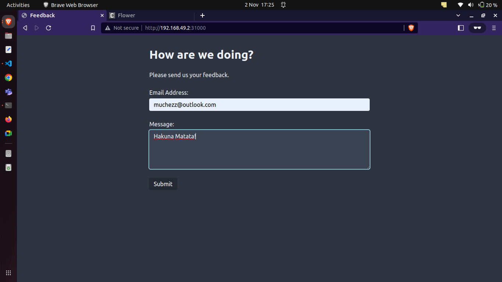
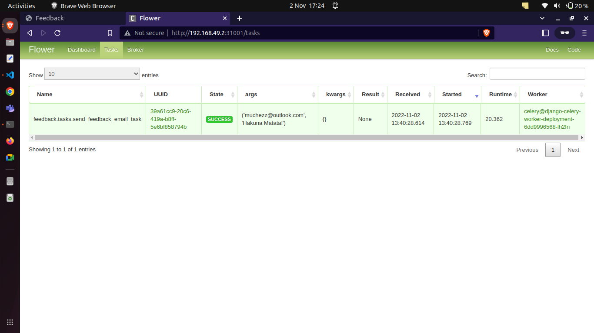

# Challenge
Software Developers have been tasked with creating an interface for collecting user feedback and mailing it. They have chosen to separate the user interface from the mailing process using separate webserver and worker service as described in the ***Asynchronous Tasks with Django and Celery*** section.

As a Devops engineer, you are asked to accomplish the following tasks to make the application production ready:

### 1. Production Readiness
Identify and separate points of concern by
* Implementing a production webserver.
* Implementing a reverse proxy to serve traffic.
* Implementing a production database.
* Managed services to handle automatic start/restarts of processes.

### 2. Containerization
In order for developers to submit an exact replica of their application to QA for testing, create a containerized stack with easily deployable artifacts via a configuration file(yaml/json/etc).

### 3. Deploy to Cloud
Using minikube as your cloud infrastructure, setup a k8s cluster and deploy the now containerized stack, with enhancements including:
* Load balancer
* High availability/redundancy
* Application logging and monitoring
* CI/CD pipeline
* Documentation
* etc

# Asynchronous Tasks with Django and Celery

Example project for integrating Celery and Redis into a Django application.
This repository holds the code for the Real Python [Asynchronous Tasks With Django and Celery](https://realpython.com/asynchronous-tasks-with-django-and-celery/) tutorial.

### Production Readiness
* Gunicorn has been a production webserver.
* Nginx has been used a reverse proxy to serve traffic.
* For a production database, postgres has been deployed running in a container.


There are two ways of runnng this application
1. With Docker compose in Minikube
2. With Kubernetes
##### With Docker compose in Minikube

Flower has been used to visualize celery and Nginx used as reverse proxy for the application.
Celery logs are stored in /app/logs/celery.logs

To start the application 

```sh
$ docker-compose up                         
```
View the django application from address `127.0.0.1` or `localhost`
##### Celery Flower

Go to `localhost:5555/` or `127.0.0.1:5555` to view celery from flower


### With Kubernetes
Add the cluster KUBECTL_CONFIG, Dockerhub username and password to the github action secrets

```
DOCKERHUB_PASSWORD
DOCKER_USER
KUBECTL_CONFIG 
```
and 
* Github actions have been used for CICD.
* Dockerhub has been used as the image repositry.
* Metric server has been used to monitor containers
* Ingress for loadbalancing

#### With Minikube 
Was unable to do CICD to Minikube

```kubernetes
  kubectl apply -f ./k8s/app/deploy.yaml
  kubectl apply -f ./k8s/celery-worker/celery-worker.yaml
  kubectl apply -f ./k8s/celery-flower/celery-flower.yaml
  kubectl apply -f ./k8s/redis/redis-deploy.yaml
  kubectl apply -f ./k8s/postgres/postgres-deploy.yaml
  kubectl apply -f ./k8s/secrets.yaml
  kubectl apply -f ./k8s/config_map.yaml
```

##### To check services
```kubernetes
kubectl get service                     
```
##### Get app service
```kubernetes
kubectl get service django-cluster-ip-service                    
```
##### Get flower service
```kubernetes
kubectl get service  django-celery-flower-load-balancer                   
```

##### Visit the Service via NodePort:
```kubernetes
minikube service {{service}} --url                   
```
Repeat for both app and flower

The output is similar to:
```
192.168.49.2:31000
192.168.49.2:31001                   
```
You can now access the sample app via the Minikube IP address and NodePort.
App



Flower


##### Get app pods
```kubernetes
kubectl get pod                  
```

Check the logs for the celery pod. Should get something like this 

```sh
[2022-11-02 09:44:09,299: INFO/MainProcess] celery@django-celery-worker-deployment-6dd9996568-lh2fn ready.
[2022-11-02 09:44:17,784: INFO/MainProcess] Events of group {task} enabled by remote.
[2022-11-02 13:40:28,590: INFO/MainProcess] Task feedback.tasks.send_feedback_email_task[39a61cc9-20c6-419a-b8ff-5e6bf858794b] received
[2022-11-02 13:40:49,099: WARNING/ForkPoolWorker-8] Content-Type: text/plain; charset="utf-8"
MIME-Version: 1.0
Content-Transfer-Encoding: 7bit
Subject: Your Feedback
From: support@example.com
To: muchezz@outlook.com
Date: Wed, 02 Nov 2022 13:40:49 -0000
Message-ID: 
 <166739644904.15.10427693004458560134@django-celery-worker-deployment-6dd9996568-lh2fn>

	Hakuna Matata!

Thank you!
[2022-11-02 13:40:49,099: WARNING/ForkPoolWorker-8] -------------------------------------------------------------------------------
[2022-11-02 13:40:49,131: INFO/ForkPoolWorker-8] Task feedback.tasks.send_feedback_email_task[39a61cc9-20c6-419a-b8ff-5e6bf858794b] succeeded in 20.361738793000768s: None

```
#### With Cloud providers


A git push will trigger and image build to dockerhub.

Github actions with deploy to a cloud provider


In the CI workflow, this will update the docker image tag with BUILD_NUMBER

```
  export BUILD_TAG=django-prod-$BUILD_NUMBER
    sed -i "s/VERSION/${BUILD_TAG}/g" ./k8s/app/deploy.yaml
    sed -i "s/VERSION/${BUILD_TAG}/g" ./k8s/celery-worker/celery-worker.yaml
    sed -i "s/VERSION/${BUILD_TAG}/g" ./k8s/celery-flower/celery-flower.yaml

  ```


### What to do better

- Use Traefik as the reverse proxy and load balancer
- 
